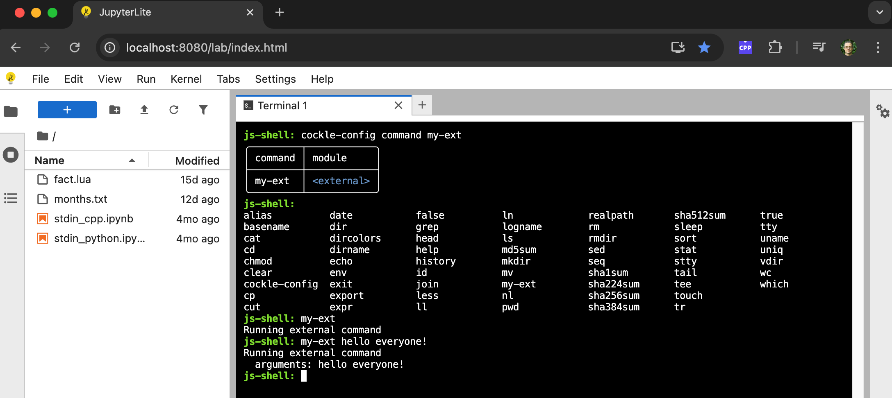

# terminal-external-command

An example of a JupyterLite extension containing a [cockle](https://github.com/jupyterlite/cockle)
external command written in TypeScript that can be used in a JupyterLite
[terminal](https://github.com/jupyterlite/terminal). It includes an example deployment using the
extension.

A `cockle` external command runs in the main UI thread and does not have direct access to the
[Emscripten file system](https://emscripten.org/docs/api_reference/Filesystem-API.html). For an
example of a JavaScript command that runs in the `cockle` Web Worker and does have direct access to
the Emscripten file system see
[terminal-javascript-command](https://github.com/ianthomas/terminal-javascript-command) instead.

## Instructions to recreate this repository

### Initial project

This repository was created following the
[JupyterLab extension tutorial](https://jupyterlab.readthedocs.io/en/stable/extension/extension_tutorial.html)
to create the initial project from the `copier` template using:

```bash
mkdir terminal-external-command
cd terminal-external-command
copier copy --trust https://github.com/jupyterlab/extension-template .
```

Answers to the `copier` questions:
1. Extension kind = frontend
2. Extension author name = Ian Thomas
3. Extension author email = ianthomas23@gmail.com
4. JavaScript package name = terminal-external-command
5. Python package name = terminal_external_command
6. Short description = A JupyterLite extension containing a terminal external command
7. User settings = no
8. Binder example = no
9. Create tests = yes
10. Git repo URL = https://github.com/ianthomas23/terminal-external-command

Commit the initial project using:
```bash
git init
git add .
git commit -m 'Initial commit from template'
```

### Add external command

Follow these steps to add the new external command to the project:

1. Add `"jupyterlite_terminal>=1.0.1"` to the `dependencies` section of `pyproject.toml`
2. Add `cockle` and `terminal` dependencies:
   ```bash
   npm add --save-dev @jupyterlite/cockle @jupyterlite/terminal
   ```
3. Add `sharedPackages` section to the `jupyterlab` key in `package.json` containing:
   ```json
   "sharedPackages": {
       "@jupyterlite/terminal": {
           "bundled": false,
           "singleton": true
       }
   }
   ```
4. Edit `src/index.ts` to add the basic external command functionality. This comprises:
   a. Some imports from `@jupyterlite/cockle` and `@jupyterlite/terminal`.
   b. The command itself in a new function called `myExternalCommand`.
   c. Modify the `JupyterFrontEndPlugin` to register the external command with the
      `ILiteTerminalAPIClient` with the name `my-ext`.
5. Create a `micromamba` environment to build and deploy the extension:
   ```bash
   micromamba create -n terminal-external-command python nodejs
   micromamba activate terminal-external-command
   pip install jupyterlab jupyterlite-core
   ```
6. Build the extension:
   ```bash
   pip install -ve .
   jupyter labextension develop --overwrite .
   ```

### Create deployment

The repo includes files to create a JupyterLite deployment using the extension, to show how this is
done and to demonstrate the command works.

1. Create deployment directory:
   ```bash
   mkdir deploy
   cd deploy
   ```
2. Create `jupyter-lite.json` containing:
   ```json
   {
     "jupyter-lite-schema-version": 0,
     "jupyter-config-data": {
       "terminalsAvailable": true
     }
   }
   ```
   This is needed as JupyterLite by default disables terminals as the terminal extension is shipped
   separately.
3. Add to `git`:
   ```bash
   git add jupyter-lite.json
   ```
4. Build the deployment:
   ```bash
   jupyter lite build
   ```
5. Serve the deployment using:
   ```bash
   npx static-handler _output/
   ```
6. Use the deployment:
   a.  Navigate in a web browser to http://localhost:8080.
   b. To confirm that the command is available and runs correctly, open a terminal and run
      `cockle-config command my-ext`; you can use tab completion for this. This will show that the
      `my-ext` command is registered and is an external command.
   c. You can list all available commands by pressing the tab key at an empty prompt.
   d. Run the `my-ext` command, again using tab completion if you wish. The command writes a message
      to the terminal and also writes any arguments passed to the command.



---

Below this is the usual boilerplate README created by `copier`.

---

# terminal_external_command

[](https://github.com/ianthomas23/terminal-external-command/actions/workflows/build.yml)

A JupyterLite extension containing a terminal external command

## Requirements

- JupyterLab >= 4.0.0

## Install

To install the extension, execute:

```bash
pip install terminal_external_command
```

## Uninstall

To remove the extension, execute:

```bash
pip uninstall terminal_external_command
```

## Contributing

### Development install

Note: You will need NodeJS to build the extension package.

The `jlpm` command is JupyterLab's pinned version of
[yarn](https://yarnpkg.com/) that is installed with JupyterLab. You may use
`yarn` or `npm` in lieu of `jlpm` below.

```bash
# Clone the repo to your local environment
# Change directory to the terminal_external_command directory
# Install package in development mode
pip install -e "."
# Link your development version of the extension with JupyterLab
jupyter labextension develop . --overwrite
# Rebuild extension Typescript source after making changes
jlpm build
```

You can watch the source directory and run JupyterLab at the same time in different terminals to watch for changes in the extension's source and automatically rebuild the extension.

```bash
# Watch the source directory in one terminal, automatically rebuilding when needed
jlpm watch
# Run JupyterLab in another terminal
jupyter lab
```

With the watch command running, every saved change will immediately be built locally and available in your running JupyterLab. Refresh JupyterLab to load the change in your browser (you may need to wait several seconds for the extension to be rebuilt).

By default, the `jlpm build` command generates the source maps for this extension to make it easier to debug using the browser dev tools. To also generate source maps for the JupyterLab core extensions, you can run the following command:

```bash
jupyter lab build --minimize=False
```

### Development uninstall

```bash
pip uninstall terminal_external_command
```

In development mode, you will also need to remove the symlink created by `jupyter labextension develop`
command. To find its location, you can run `jupyter labextension list` to figure out where the `labextensions`
folder is located. Then you can remove the symlink named `terminal-external-command` within that folder.

### Testing the extension

#### Frontend tests

This extension is using [Jest](https://jestjs.io/) for JavaScript code testing.

To execute them, execute:

```sh
jlpm
jlpm test
```

#### Integration tests

This extension uses [Playwright](https://playwright.dev/docs/intro) for the integration tests (aka user level tests).
More precisely, the JupyterLab helper [Galata](https://github.com/jupyterlab/jupyterlab/tree/master/galata) is used to handle testing the extension in JupyterLab.

More information are provided within the [ui-tests](./ui-tests/README.md) README.

### Packaging the extension

See [RELEASE](RELEASE.md)
